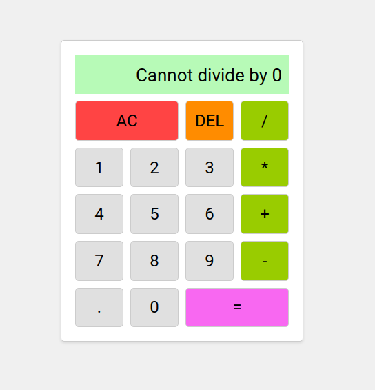

# Calculator
Live demo &#128073;  https://masecurity.github.io/Calculator/
## What is a Calculator?
A calculator is a simple electronic or digital device used to perform mathematical calculations. It allows users to perform basic arithmetic operations like addition, subtraction, multiplication, and division, as well as more complex calculations involving percentages, square roots, and more. Calculators are widely used in various fields, including education, finance, engineering, science, and everyday life.

This project is a simple web-based calculator implemented using HTML, CSS, and JavaScript. It provides a user interface with buttons for numbers, basic arithmetic operations, and a display to show the current and previous operands along with the result of calculations.

## What i learned
- <strong>DOM Manipulation:</strong> I gained a better understanding of interacting with the Document Object Model (DOM) using JavaScript to access and modify elements in the HTML document.
- <strong>Event Handling:</strong> I learned how to add event listeners to HTML elements and respond to user interactions, such as button clicks.
- <strong>JavaScript Functions:</strong> I implemented various JavaScript functions to handle different aspects of the calculator's functionality, including number input, arithmetic   operations, and clearing the display.
- <strong>Switch Statements:</strong> I used switch statements to perform different operations based on the selected arithmetic operator.
- <strong>Data Attributes:</strong> I utilized data attributes in HTML to attach relevant data to elements, making it easier to select and interact with them in JavaScript.
- <strong>CSS Grid Layout:</strong> I utilized CSS grid layout to create a simple calculator layout, arranging buttons and display elements in a grid.
- <strong>Styling with CSS:</strong> I applied styles to the calculator using CSS, including button appearance on hover and click.
- <strong>Error Handling:</strong> I added a check to prevent division by zero and displayed an error message when attempting such an operation.

Overall, this project provided a hands-on learning experience in web development fundamentals, enabling me to create a functional calculator application using HTML, CSS, and JavaScript.
